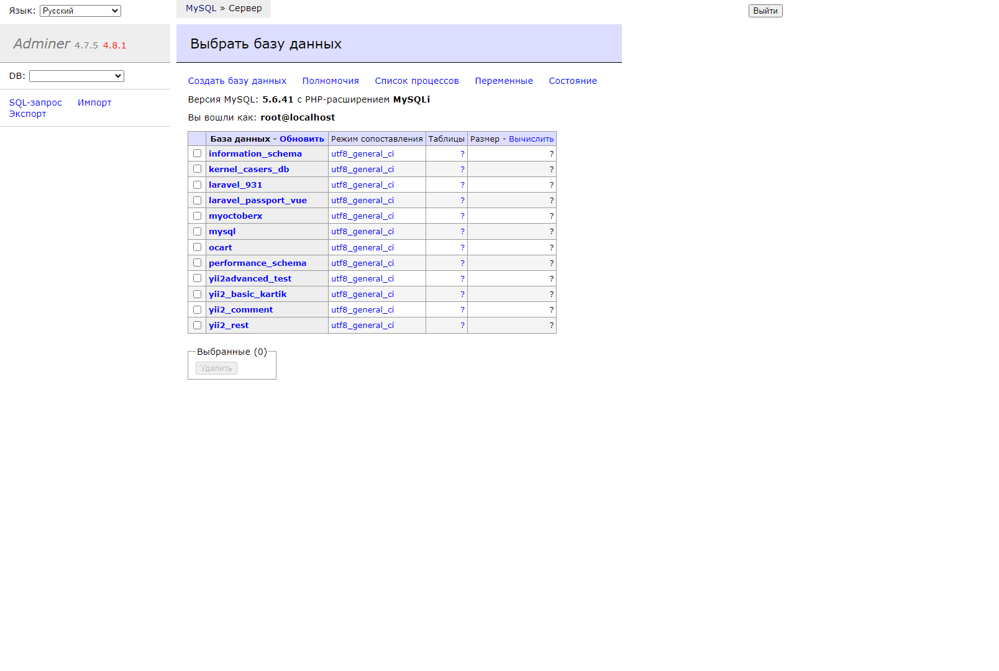
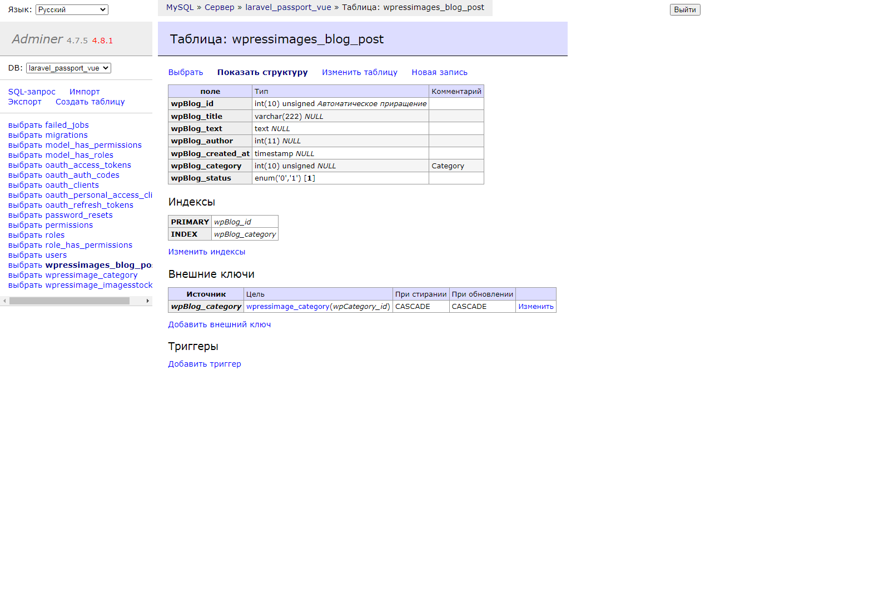
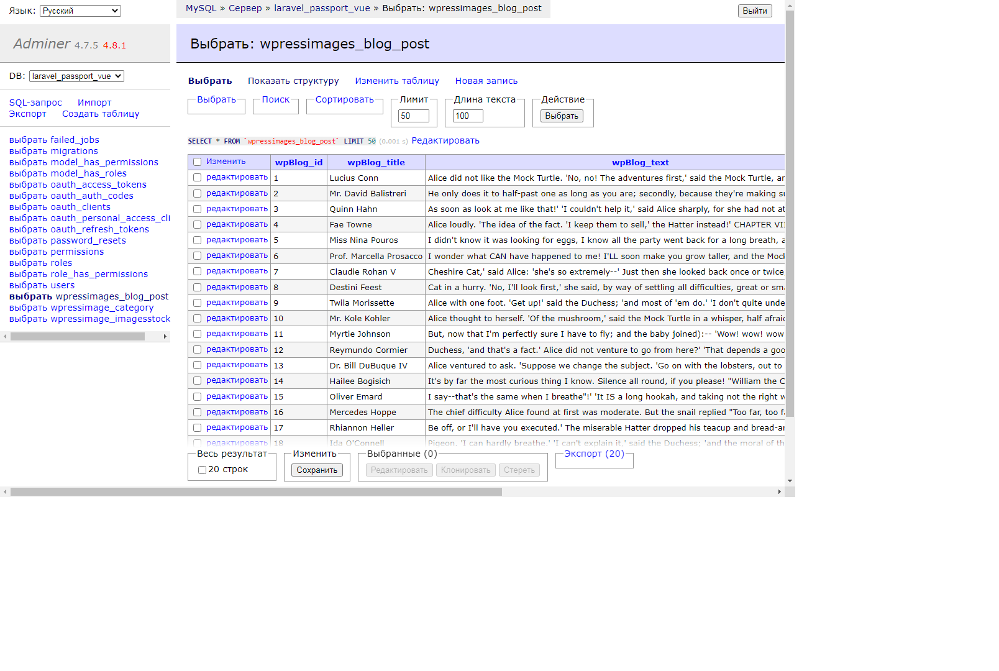

## Adminer 
- 
 Database management in a single PHP file. 

- 
Replace phpMyAdmin with Adminer and you will get a tidier user interface, better support for MySQL features, higher performance and more security. 

## How to use:
- 
 Upload root file adminer-4.8.1.php to anywhere and run it. Requires DB passwors, so u can't use it if your localhost SQL DB does not use password, i.e user: root, password: ''

- 
 If you want to test Adminer on localhost whithout password, use /Adminer_without_SQL_password/adminer-start-file.php. NB: Yoo have to put some tempo password in Line 9 there and use it for log in 

## Screenshots

- [Adminer](https://www.adminer.org/en/).

