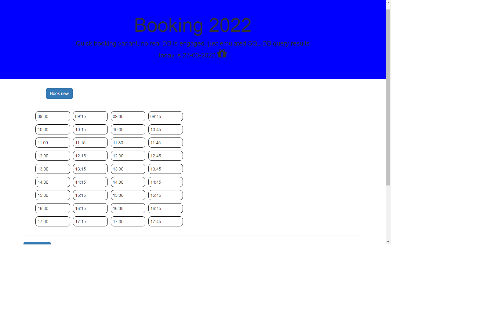
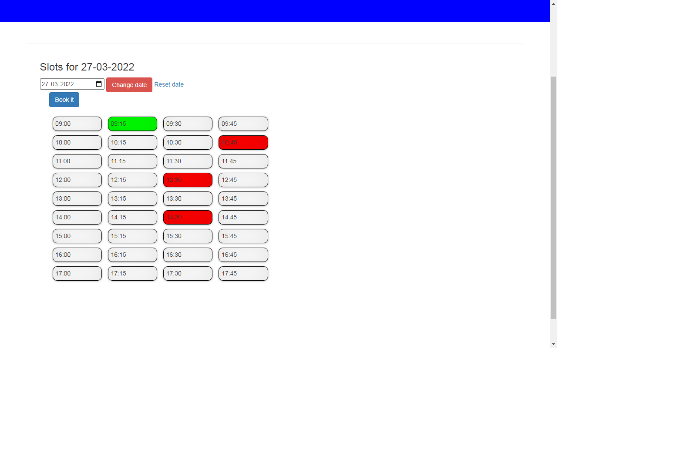
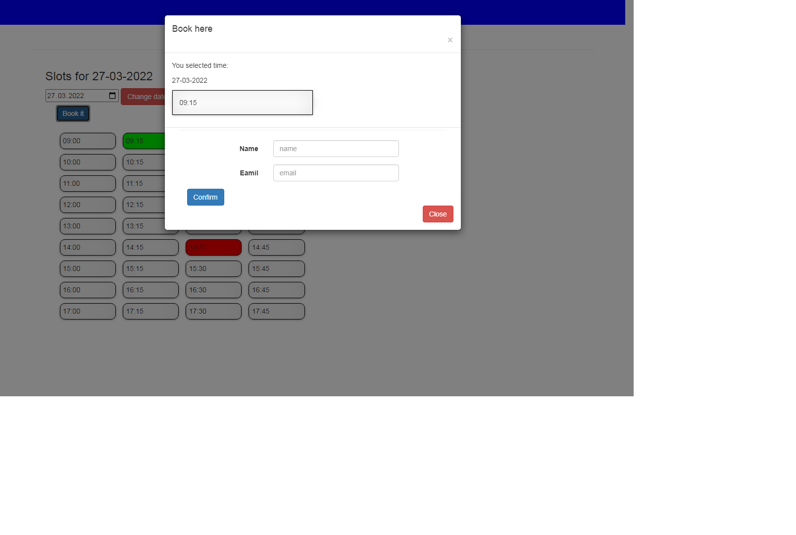
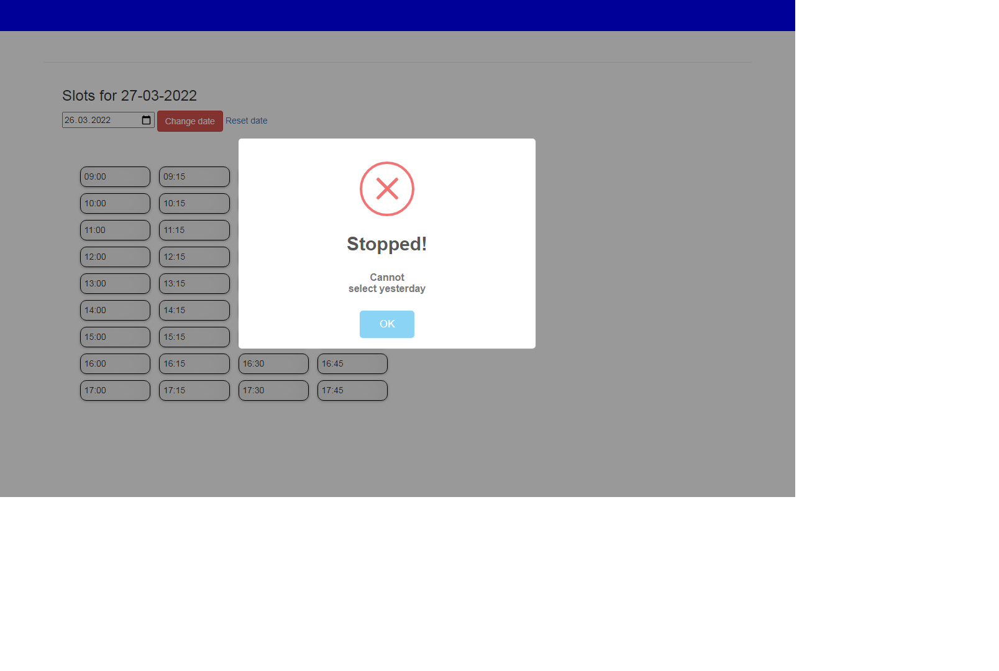
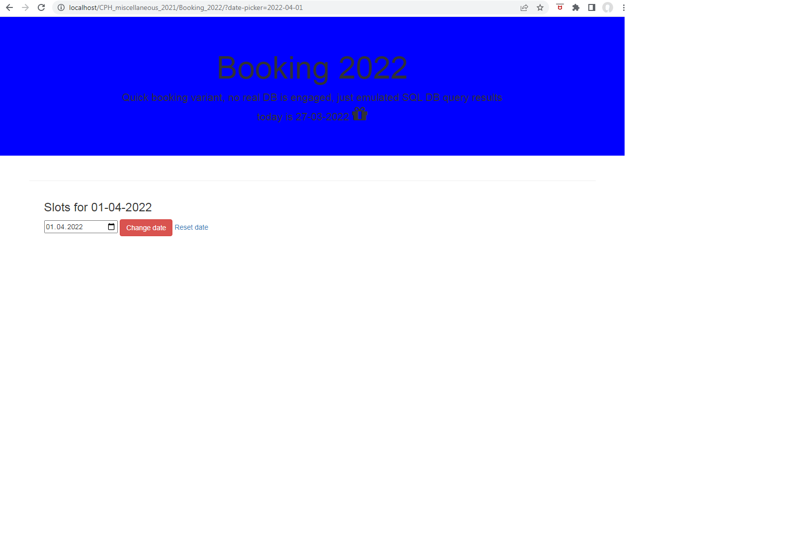
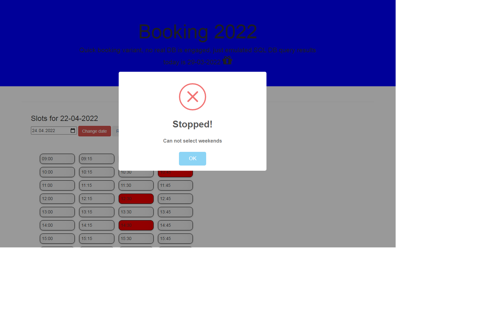
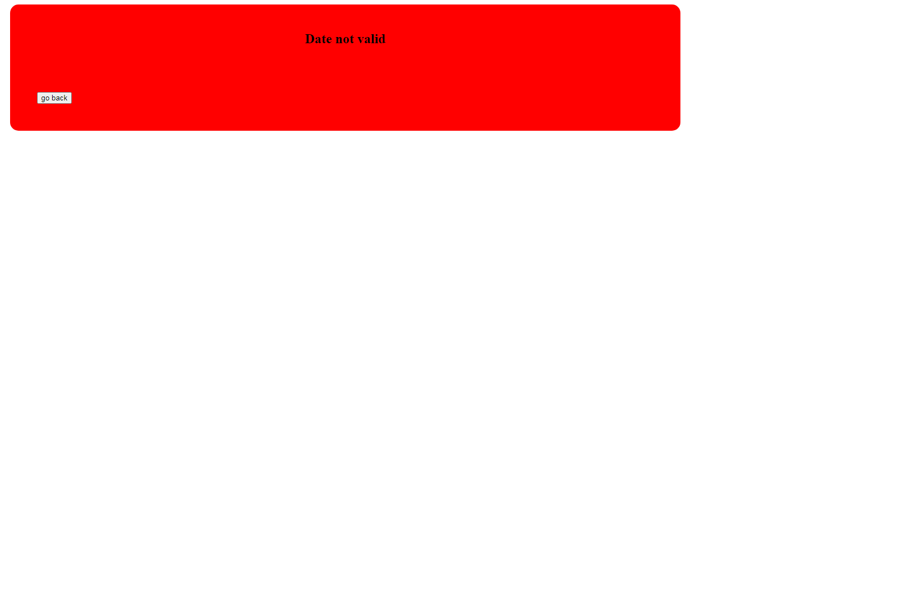

### Readme
>  Quick booking variant, no real DB is engaged, just emulated SQL DB query results. SQL is defined in Classes\My_Booking\BookingProcess. Type: Array of objects
>  https://code-boxx.com/simple-php-reservation-system/

- 
 Not implemented 100%, just reading the sql data and building the time slots, but quite enough to develop further

- 
 Working hours and slots interval are defined in Classes\My_Booking\BookingProcess in function createSchedule

- 
 What date to use for processing is defined in index.php on checkeing $_GET['date-picker'], if set (i.e user clicked "changed date" or changed url manually), use $_GET['date-picker'], otherwise use today

- 
In booking_2022.js on load we check $_GET['date-picker'] and set value of input type="date" accordingly

## Time slots

