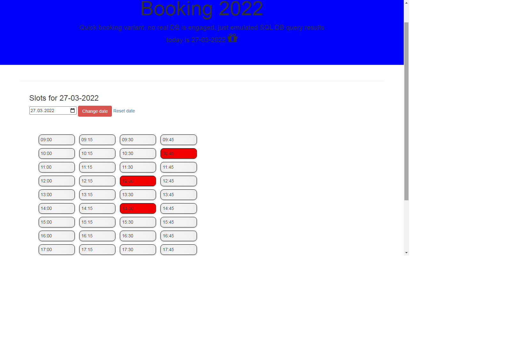

### Readme
>  Quick booking variant, no real DB is engaged, just emulated SQL DB query results. SQL is defined in Classes\My_Booking\BookingProcess. Type: Array of objects
>  https://code-boxx.com/simple-php-reservation-system/

- 
 Not implemented 100%, just reading the sql data and building the time slots, but quit enough to develop further

- 
 Working hours and slots interval are defined in Classes\My_Booking\BookingProcess in function createSchedule

## Time slots

