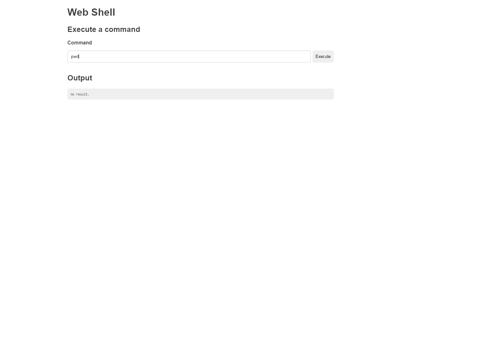

## Simple-PHP-Web-Shell
- 
 A really simple & tiny PHP Web shell for executing unix commands from web page.. 

## How to use:
- 
 df -h               => list disk volums 

- 
 pwd                 => view the directory files in UNIX  (or {dir} in Wind) 

- 
 ls -a  or(just ls)  => view derictory  content 

- 
 #cd folder + TAB    => to autofill folders name  -working 
 
- 
 $ cd ..             => root folder (go 1 level up) 

## Screenshots

- [AdminerSimple-PHP-Web-Shell](https://github.com/artyuum/Simple-PHP-Web-Shell).

